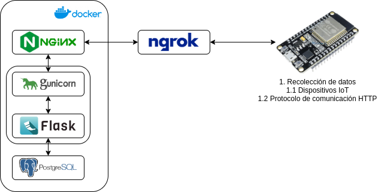

# NGINX
## Web server

Hola mundo en `index.html`

http://localhost:8080/

## Reverse proxy

Paso hacia el Python API

### Time to Alive (TTL)

Ingresar en navegador a http://localhost:8080/api/ttl o usando el comando `curl`

# Python API

Testear el end-point. Desde máquina local o de un contenedor que expone su puerto al exterior (máquina local)
```
curl -X GET http://localhost:5000/ttl
```

Comando curl con tipo de request, header y datos.

```
curl -X POST -H "Content-Type: application/json" -d '{}' http://localhost:5000
```

# Comandos útiles Docker

Verificar validez de la sintaxis y configuración del archivo `docker-compose.yml`

```
docker compose config
```