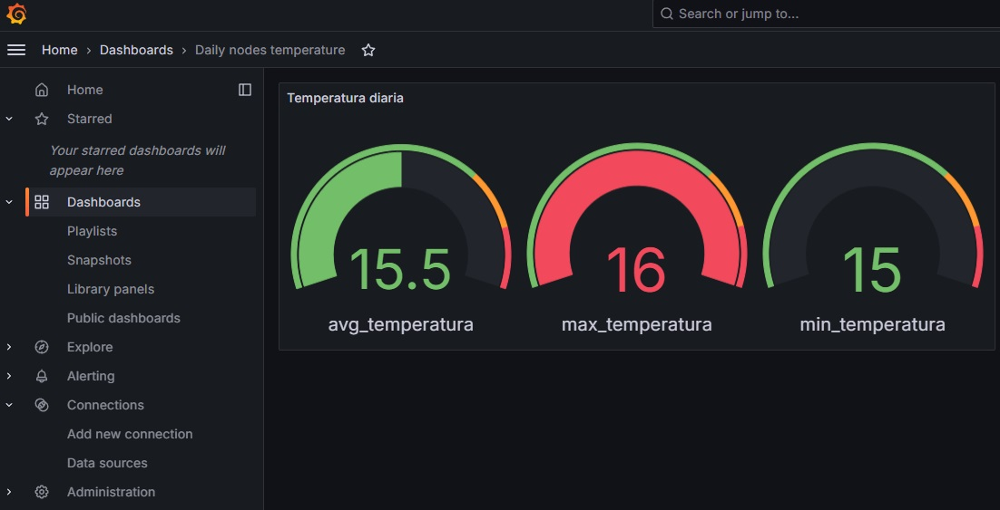

# IoT Data Stack Demo

This stack is a demo of what I've implemented to manage the observational data send from Internet of Things devices, using an internet connection.

The stack contemplates the following stages for handling the data:
- Receiving weather data using the internet, through a **ngrok** tunnel
- Decode data, using a **Flask** API
- Save decoded data in a **PostgreSQL** database
- Show daily weather data agregations using a **Grafana** dashboard

This demo uses five **Docker** containers. To start it, set environment variables and just use:

```
docker compose up -d
```

## IoT devices

A variety of devices are available, such as ESP32. IoT devices send their data in a JSON format, which I have simulated using a `curl` in console.

```
curl \
-X POST \
-d "{'node_id': 'nodo_2', 'timestamp': '2025-01-19 22:43:00', 'sensor_id': 'TEMP', 'value': 15}" \
-H "Content-Type: application/json" \
http://my-ngrok-free-url.ngrok-free.app/add_data
```

## ngrok tunnel

This stack deploys an [ngrok](https://ngrok.com/) agent in a container, wich allows to use a secure tunnel to communicate the IoT devices and our Flask API.

You will need an ngrok account, to set the `NGROK_AUTHTOKEN` and `NGROK_URL` on the `.env` file.

## Flask API

Deployed in another container, this Flask API uses Gunicorn as WSGI and presents three end-points:

1. TTL ignal, using `GET` method. Can be used to know if the API is alive.
2. Add data, using `POST` method. Expects weather data from IoT devices in a JSON format.
3. Database check, uses `POST` method. Returns the PostgreSQL version.

This API also checks if the database and target table exists. If not they're created before inserting new data when using the `/add_data` end-point.

## PostgreSQL

Deployed in yet another container. Uses the environment variables set in the `.env` file. It also use a Docker volume for the database storage files.

## Grafana

Uses a database view, to display daily agregations of temperature. If the `temperatura_diaria` view doesn't exists, it will be created when using the `/add_data` end-point.



## NGINX

I've added an extra layer of security, by allowing the end user to reach the Grafana throug a reverse proxy.

Also a "Hello world" page can be found at [http://localhost:8080/](http://localhost:8080/)
