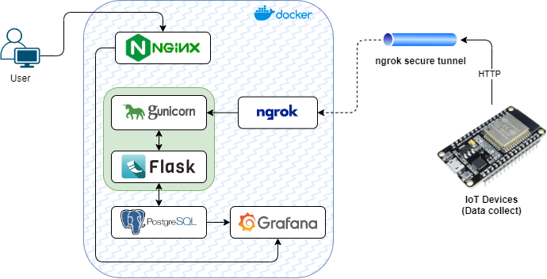

# NGINX
## Web server

Hola mundo en `index.html`

http://localhost:8080/

## Reverse proxy

Paso hacia el Python API

http://localhost:8080/api/ttl

# Python API

Testear el end-point
```
curl -X GET http://localhost:5555/ttl
```